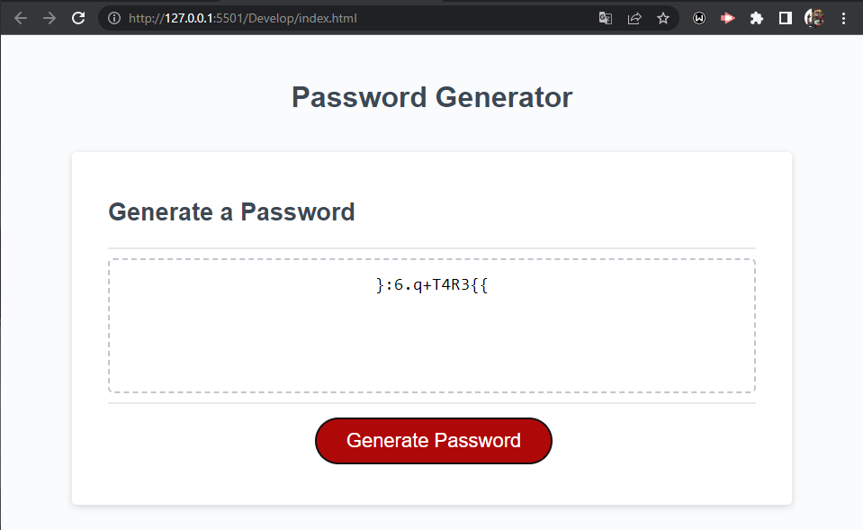

# 03 JavaScript: Password Generator

## Description
This application aims to help people in need of passwords with specific requirements by generating password depending on the users specification.
I decided to build this application in order to help people generate passwords to their liking and by allowing them to select among a few different options to include in said passwords.
I learnt abot concatenating arrays by using methods and using functions in order to better solve individual actions.

## Usage

This is avery simple application, just click the "Generate password" button to get started and select the options that better suit your needs when creating your new password.
You can select to either include or exclude the next options: upper case letters, lowercase letters, numbers and special characters. 

## Credits

This application was built be me with prewritten HTML and CSS sections and with a headstart on the JavaScript section.

## Tests

Here is a picture of how the application shows a brand new generated password!

